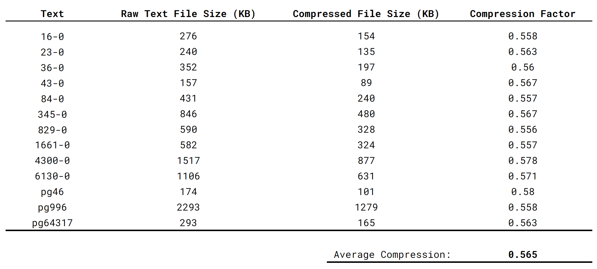

# Huffman Coding
Huffman coding enables compression of text-based files
by manipulating character bit representations such that more
commonly used characters are stored in fewer bits than less
commonly used characters. For more information about the
theory being Huffman Coding, see the
[wiki page](https://en.wikipedia.org/wiki/Huffman_coding).
Two main classes are provided here: HuffmanCodeBook and
HuffmanCodeTree. _(note: HuffmanNode is a class used within
the HuffmanCodeTree class)_

## HuffmanCodeBook
The HuffmanCodeBook class is a map abstract data structure
that can be used for _encoding_ text files into encoded
binary sequences. Internally, the map is implemented using
a binary search tree, storing at each node a character/bit sequence
pair. The tree is organized by the integer representation
(in Java) of each node's character. This internal structure
allows for an average case runtime of O(log(N)), where N
is the number of character/bit sequence pairs in the map.

## HuffmanCodeTree
The HuffmanCodeTree class is a binary tree that can be used
for _decoding_ binary sequences into text files. This structure is the
fundamental scheme behind Huffman coding. Each node in the tree
has a '0' and a '1' child. By traversing from the root node to
a leaf node, successive 0's and 1's will be visited that form
the binary representation of the character stored at that leaf
node. This tree can then be used to associate an encoded bit
sequence (representing an entire text file) into a series of
the associated decoded characters. 

### Huffman Code Tree Example:
Consider the simple huffman code tree depicted below.

This tree can be used to decode the following binary sequence
as depicted:

By traversing successive bits until a leaf node is reached,
the binary sequence can be decoded into characters.
For more info and for a better explanation, see the Huffman coding
[wiki page](https://en.wikipedia.org/wiki/Huffman_coding).

## Example Compressions
Provided in the sample text folders are text files that have
been encoded and decoded using the Huffman code book in
ProvidedHuffmanCodeBook.java. Below is the data describing
the compression factor for each file passed through this
Huffman coding:

As shown in the data, this particular coding scheme was
able to decrease the provided text file sizes by almost
a factor of two.

## Classes Written by University of Minnesota Faculty
The following classes were written by computer science
faculty at the U of MN:

### Daniel Kluver
- ProvidedHuffmanCodeBook
- BinarySequence
- additionally, provided all the sample text files

### Mark Nie
- BinarySequence
